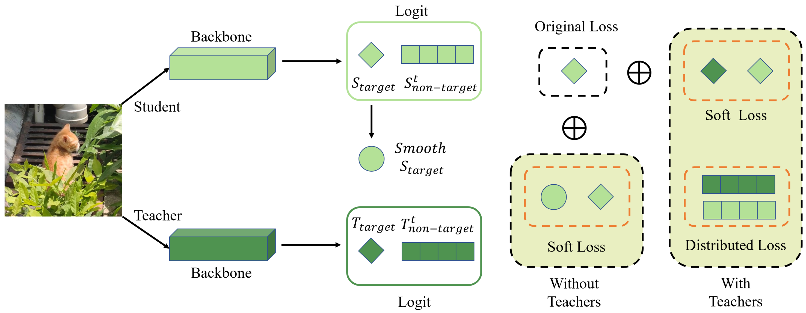

# NKD and tf-NKD
Paper: [Rethinking Knowledge Distillation via Cross-Entropy](https://arxiv.org/abs/2208.10139)



## Train

```
#single GPU
python tools/train.py configs/distillers/imagenet/res18_sd_img.py

#multi GPU
bash tools/dist_train.sh configs/distillers/imagenet/res34_distill_res18_img.py 8
```

## Transfer
```
# Tansfer the Distillation model into mmcls model
python pth_transfer.py --dis_path $dis_ckpt --output_path $new_mmcls_ckpt
```
## Test

```
#single GPU
python tools/test.py configs/resnet/resnet18_8xb32_in1k.py $new_mmcls_ckpt --metrics accuracy

#multi GPU
bash tools/dist_test.sh configs/resnet/resnet18_8xb32_in1k.py $new_mmcls_ckpt 8 --metrics accuracy
```

## Results
### NKD
|  Model   | Teacher  | Baseline(Top-1 Acc) | +NKD(Top-1 Acc) |                            dis_config                            | weight |
| :------: | :-------: | :----------------: | :------------: | :----------------------------------------------------------: | :--: |
|   ResNet18   | ResNet34 |        69.90        |      71.96 (+2.06)      | [config](https://github.com/yzd-v/cls_KD/blob/master/configs/distillers/imagenet/res34_distill_res18_img.py) | [baidu](https://pan.baidu.com/s/1u82mk5SWYLxin6AKv9fPPw?pwd=sodb)/[one drive](https://1drv.ms/u/s!Ah7OVljahSArnWB-ra7Zwe1T7SNO?e=iQhdde) |
| MobileNet | ResNet50 |        69.21        |      72.58 (+3.37)      | [config](https://github.com/yzd-v/cls_KD/blob/master/configs/distillers/imagenet/res50_distill_mv1_img.py) | [baidu](https://pan.baidu.com/s/1uENiLmj5HpYyLY0dTkeeMg?pwd=paak)/[one drive](https://1drv.ms/u/s!Ah7OVljahSArnVoW0JxXFAZXVoOf?e=yKaAba) |

### tf-NKD
|  Model   | Baseline(Top-1 Acc) | +tf-NKD(Top-1 Acc) |                            dis_config                            |
| :------: | :----------------: | :------------: | :----------------------------------------------------------: |
| MobileNet |        69.21        |      70.04 (+0.83)      | [config](https://github.com/yzd-v/cls_KD/blob/master/configs/distillers/imagenet/mv1_sd_img.py) |
| MobileNetV2 |        71.86        |      72.08 (+0.22)      | [config](https://github.com/yzd-v/cls_KD/blob/master/configs/distillers/imagenet/mv2_sd_img.py) |
| ShuffleNetV2 |        69.55        |      69.93 (+0.38)      | [config](https://github.com/yzd-v/cls_KD/blob/master/configs/distillers/imagenet/mv1_sd_img.py) |
|   ResNet18   |        69.90        |      70.76 (+0.86)      | [config](https://github.com/yzd-v/cls_KD/blob/master/configs/distillers/imagenet/res18_sd_img.py) |
|   ResNet50   |        76.55        |      76.93 (+0.38)      | [config](https://github.com/yzd-v/cls_KD/blob/master/configs/distillers/imagenet/res50_sd_img.py) |
|   Swin-Tiny   |        81.18        |      81.48 (+0.30)      | [config](https://github.com/yzd-v/cls_KD/blob/master/configs/distillers/imagenet/swin-t_sd_img.py) |

## Citation
```
@article{yang2022rethinking,
  title={Rethinking Knowledge Distillation via Cross-Entropy},
  author={Yang, Zhendong and Li, Zhe and Gong, Yuan and Zhang, Tianke and Lao, Shanshan and Yuan, Chun and Li, Yu},
  journal={arXiv preprint arXiv:2208.10139},
  year={2022}
}
```