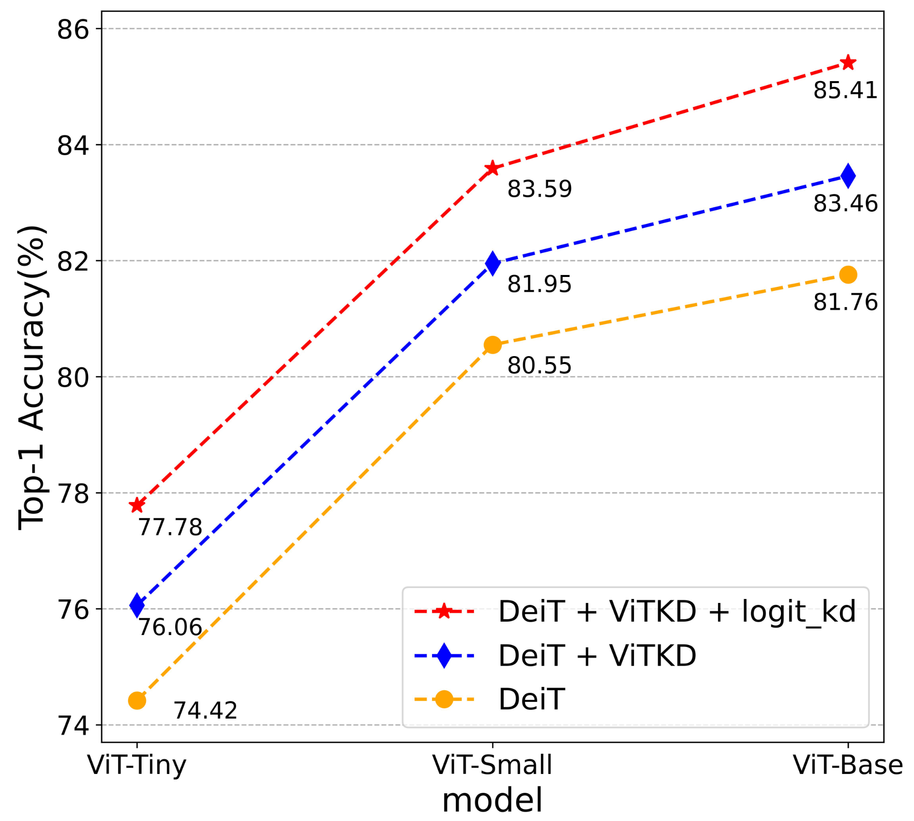

# ViTKD
Paper: [ViTKD: Practical Guidelines for ViT feature knowledge distillation](https://arxiv.org/abs/2209.02432)


## Train

```
#multi GPU
bash tools/dist_train.sh configs/distillers/imagenet/deit-s3_distill_deit-t_img.py 4
```

## Transfer
```
# Tansfer the Distillation model into mmcls model
python pth_transfer.py --dis_path $dis_ckpt --output_path $new_mmcls_ckpt
```
## Test

```
#multi GPU
bash tools/dist_test.sh configs/deit/deit-tiny_pt-4xb256_in1k.py $new_mmcls_ckpt 8 --metrics accuracy
```

## Results

<style>
    img[alt="comparison"]{
        width:450px;
    }
</style>


|  Model   | Teacher  | Baseline | ViTKD | weight | ViTKD+NKD | weight |                            dis_config                            |
| :------: | :-------: | :----------------: | :------------: | :--: | :--: | :--: | :----------------------------------------------------------: |
|   DeiT-Tiny   | [DeiT III-Small](https://pan.baidu.com/s/1asMuS6E7OmdZzQBH9ugCZg?pwd=83x7) |        74.42        |      76.06 (+1.64)      |[baidu](https://pan.baidu.com/s/1OYGeZ2P8RRdEIWM3diyzQA?pwd=niiw)|77.78 (+3.36)| [baidu](https://pan.baidu.com/s/1StOAQziPEvvHzQqWvy20vQ?pwd=emct) | [config](https://github.com/yzd-v/cls_KD/blob/master/configs/distillers/imagenet/deit-s3_distill_deit-t_img.py) |
|   DeiT-Small   | [DeiT III-Base](https://pan.baidu.com/s/15HNMudacNlBUCZ6ySFhENg?pwd=6mmp) |        80.55        |      81.95 (+1.40)      |[baidu](https://pan.baidu.com/s/17O64Q4py6Ex1ohjnrPpiew?pwd=4srr)|83.59 (+3.04)| [baidu](https://pan.baidu.com/s/1OThOyOR60CCxszxB6rY4QQ?pwd=4x90) | [config](https://github.com/yzd-v/cls_KD/blob/master/configs/distillers/imagenet/deit-b3_distill_deit-s_img.py) |
|   DeiT-Base   | [DeiT III-Large](https://pan.baidu.com/s/1qdgcTMz_FeBfEH2rchh_yg?pwd=n5hf) |        81.76        |      83.46 (+1.70)      |[baidu](https://pan.baidu.com/s/1Qytl5BHpc3qdlYSQq750FQ?pwd=ej2k)|85.41 (+3.65)| [baidu](https://pan.baidu.com/s/19Zxq4g3Z1mGhDPjkbG_t0g?pwd=q915) | [config](https://github.com/yzd-v/cls_KD/blob/master/configs/distillers/imagenet/deit-l3_distill_deit-b_img.py) |

## Citation
```
@article{yang2022vitkd,
  title={ViTKD: Practical Guidelines for ViT feature knowledge distillation},
  author={Yang, Zhendong and Li, Zhe and Zeng, Ailing and Li, Zexian and Yuan, Chun and Li, Yu},
  journal={arXiv preprint arXiv:2209.02432},
  year={2022}
}
```